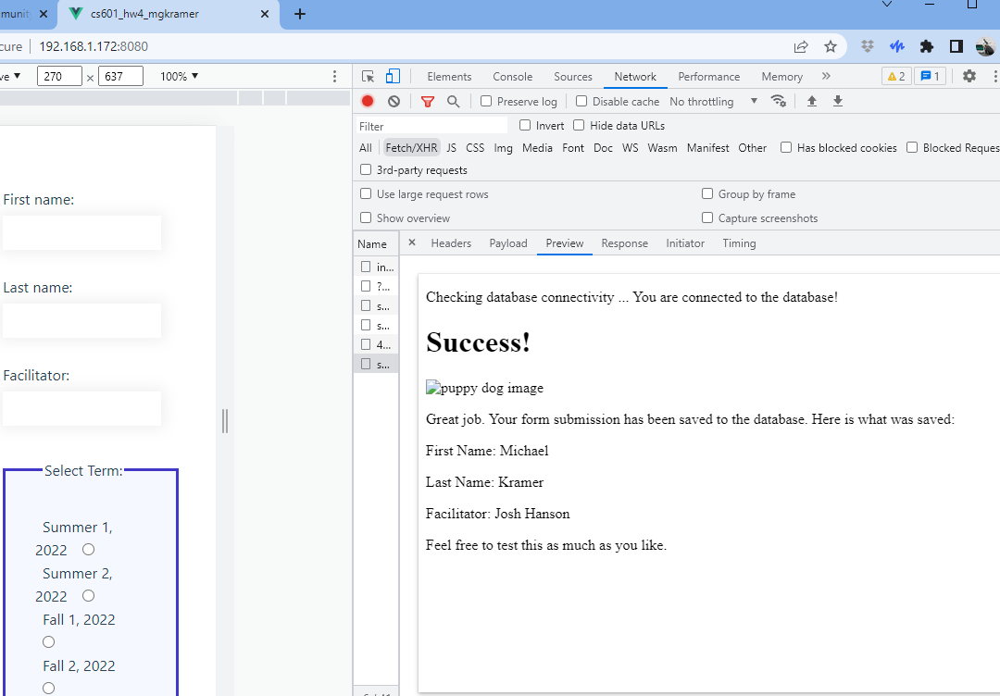

# cs601_hw4_mgkramer

## Project setup
```
npm install
```

# How To Run
* Compiles and hot-reloads for development
```
npm run serve
```

### Compiles and minifies for production
```
npm run build
```

### Lints and fixes files
```
npm run lint
```

### Customize configuration
See [Configuration Reference](https://cli.vuejs.org/config/).

# Requirements:
* Using HTML 5, CSS, and JavaScript (no other languages):
1. Create an HTML form with the following form controls:
   * text input field with a name and id value of: “firstName” (required)
     * When you submit the form: enter your first name here
   * text input field with a name and id value of: “lastName” (required)
     * When you submit the form: enter your last name here
   * text input field with a name and id of: “facilitator” (required)
   * a group of radio buttons with your choice of options
   * a group of check boxes with your choice of values
   * Style the page with CSS using an external style sheet.
   *  The form action should point to http://bucs601.com/submit.php
   using the POST method.
2. Use HTML and JavaScript to perform client-side validation based on the
   following specifications:
   * Validate both firstName and lastName to ensure:
     * a minimum length of two (2) characters
     * that only alpha characters are used (A-Z and a-z)
   * Validate facilitator and constrain the possible valid values to
   be those of the active facilitators for the course during this
   semester. For example, if we have facilitators with the following first
   names: “Laura”, “Fazil”, and “Harsh”, you would ensure that only
   these values would pass validation Laura OR Fazil OR Harsh
   * facilitator is a text input, don’t change this into a select or any
     other type of input.
   * The form should not be permitted to submit unless all fields pass
     validation.
   * When you submit your form, you will be taken to a page and you will be able to
     see if your form submission went through successfully or if there was a problem
     that needs to be fixed first. The first three field values (firstName, lastName,
     and facilitator) that you enter will be recorded in a database on the server.
     By including your first name, last name, and facilitator’s name, we will know that
     your form worked correctly. And yes, you can test the form submission as much
     as you would like, we will remove your duplicate entries from the database.

## Vue and Axios Successful Post but no Redirect SAGA: What I learned...
* Previously Implementing the form post request with axios looked like within the ```formSubmit()``` function:

```javascript
let url = 'https://bucs601.com/submit.php'
        const FormData = require('form-data');
        let bodyFormData = new FormData();
        bodyFormData.append('firstName', this.form.firstName)
        bodyFormData.append('lastName', this.form.lastName)
        bodyFormData.append('facilitator', this.form.facilitator)
        axios({
          method: "post",
          url: url,
          data: bodyFormData,
          headers: { "Content-Type": "multipart/form-data" },
        })
        .then(function(res){
          alert('form submitted ' + res)
          console.log(res)
          //window.location = res.request.responseURL
        })
        .catch(function(error) {
          alert(error);
        });
```
* There is evidence in the comment in the ```.then()``` statement of trying to redirect with ```window.location``` but this is a ```GET``` request
* Still the post request worked, sans redirecting to the success page noted in the requirements.
  * However, opening the developer tools (in Chrome shown in below screenshots) one could note the request worked
### correct headers: 

### correct payload: 

### correct preview:

### correct response (expected html)


### Explanation
* Axios does not seem to redirect upon post request
  * One would need to manually achieve this in Vue with a ```window.location = url``` assignment which is only a ```GET``` request

### Current Implementation
* Works as intended
* Got rid of axios post request code 
  * Simplified with a simple ```<form @click="formSubmit" action="https://bucs601.com/submit.php" method="post">``` solution
  * What makes this work is passing the click event like ```formSubmit(e)```
    * Then exiting the function via one of two routes:
```javascript
      if (!this.formErrors.length) { // if no errors in the form
        return true;
      }
      e.preventDefault();
```

### Current View after formSubmit() with good input


#### How I went Above and Beyond
* Implemented this assignment in Vue 
* dedicated approximately 5 hours of extra study on AJAX with axios
  * This included research into form implementations with: 
    * [Inertia Forms](https://inertiajs.com/forms)
    * [Vee Validate](https://vee-validate.logaretm.com/v4/guide/components/handling-forms)
    * [Vuelidate](https://vuelidate.js.org/)
    * And more 

## Basic Project Structure: Vue App
```
|---public
|   |__index.html
|
│   App.vue
│   main.js
│
├───assets
│   └───styles
│           style.css
│
└───components
        MyForm.vue

```

#### Note: 
My valid facilitators are "firstName'*space*'lastName" format:
```javascript
facilitators: ["Josh Hanson", "Fazil Harroon", "Christian Hur"]```